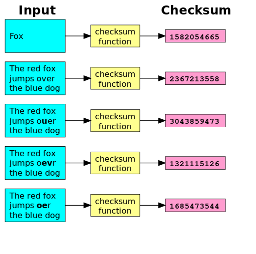

# Verifying My Client

So you've just downloaded what appears to be a Lego Universe client, but you don't know if it's the right one. Maybe it's too old? Is the download corrupted? Or worse, what if it's actually a virus?

Thankfully, there's a foolproof method to verify a client: Checksums.

## What is a checksum?

*Note: You can [skip this section](#basic-steps) if you don't care what a checksum is, I won't get offended.*

A checksum function is a procedure which takes some input data and generates an output string. The output string is always the same length, regardless of the length of the input string. The input data can be anything, including a string or a file.

The important thing to know is that if the input data is even the tiniest bit different, it will completely change the output string. See below.



By the nature of the checksum function, it is basically impossible to intentionally create a file that even resembles, much less exactly matches, a given checksum. For SHA-256 (the checksum function we will be using in this guide), the odds that two files will have the same checksum is approximately...

1 in 4,300,000,000,000,000,000,000,000,000,000,000,000,000,000,000,000,000,000,000,000

Add on top of that the odds that the file isn't a garbled mess, on top of the odds that the file resembles a Lego Universe client...

## Basic Steps

I'll go over a tutorial for each computer in a moment, but simply put, you'll be performing the following steps:

* Start with the file containing the client (it should be a single .rar file).
* Run the checksum function on the file to generate a checksum string.
* Compare it with the known good checksums available below.

If the checksum string you generated matches one of the ones below, it is guaranteed to be safe.

### Valid Checksums

Here is a list of known valid checksums for up-to-date LEGO Universe Clients.

- `8f6c7e84eca3bab93232132a88c4ae6f8367227d7eafeaa0ef9c40e86c14edf5` (packed client, rar compressed)
- `c1531bf9401426042e8bab2de04ba1b723042dc01d9907c2635033d417de9e05` (packed client, includes extra locales, rar compressed)
- `0d862f71eedcadc4494c4358261669721b40b2131101cbd6ef476c5a6ec6775b` (unpacked client, includes extra locales, rar compressed) 

## Windows

With how useful taking the checksum of a file is, it's really something that Windows should make easier to do. Just add it to the Properties panel or something!

1. Open a command line terminal (cmd.exe).
2. Run the following command, replacing `<file>` with the path to your client.
```
certutil -hashfile <file> SHA256
```
3. The command will output a long string of characters.
    - Compare it to make sure it matches one of the ones above.
    - If your client is out-of-date, corrupted, or potentially malicious, the SHA256 checksum will significantly differ from the ones above.

## MacOS

1. Open a command line terminal.
2. Run the following command, replacing `<file>` with the path to your client.
```
shasum -a 256 <file>
```
3. The command will output a long string of characters.
    - Compare it to make sure it matches one of the ones above.
    - If your client is out-of-date, corrupted, or potentially malicious, the SHA256 checksum will significantly differ from the ones above.

## Linux

1. Open a command line terminal.
2. Run the following command, replacing `<file>` with the path to your client.
```
shasum -a 256 <file>
```
3. The command will output a long string of characters.
    - Compare it to make sure it matches one of the ones above.
    - If your client is out-of-date, corrupted, or potentially malicious, the SHA256 checksum will significantly differ from the ones above. 
